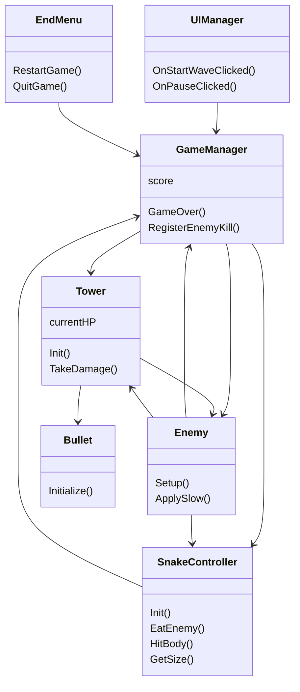

```mermaid
classDiagram

class GameManager {
    score
    GameOver()
    RegisterEnemyKill()
}

class SnakeController {
    Init()
    EatEnemy()
    HitBody()
    GetSize()
}

class Tower {
    currentHP
    Init()
    TakeDamage()
}

class Enemy {
    Setup()
    ApplySlow()
}

class Bullet {
    Initialize()
}

class UIManager {
    OnStartWaveClicked()
    OnPauseClicked()
}

class EndMenu {
    RestartGame()
    QuitGame()
}

GameManager --> Tower
GameManager --> SnakeController
GameManager --> Enemy

SnakeController --> GameManager
Enemy --> GameManager
Enemy --> SnakeController
Enemy --> Tower

Tower --> Enemy
Tower --> Bullet

UIManager --> GameManager
EndMenu --> GameManager
```