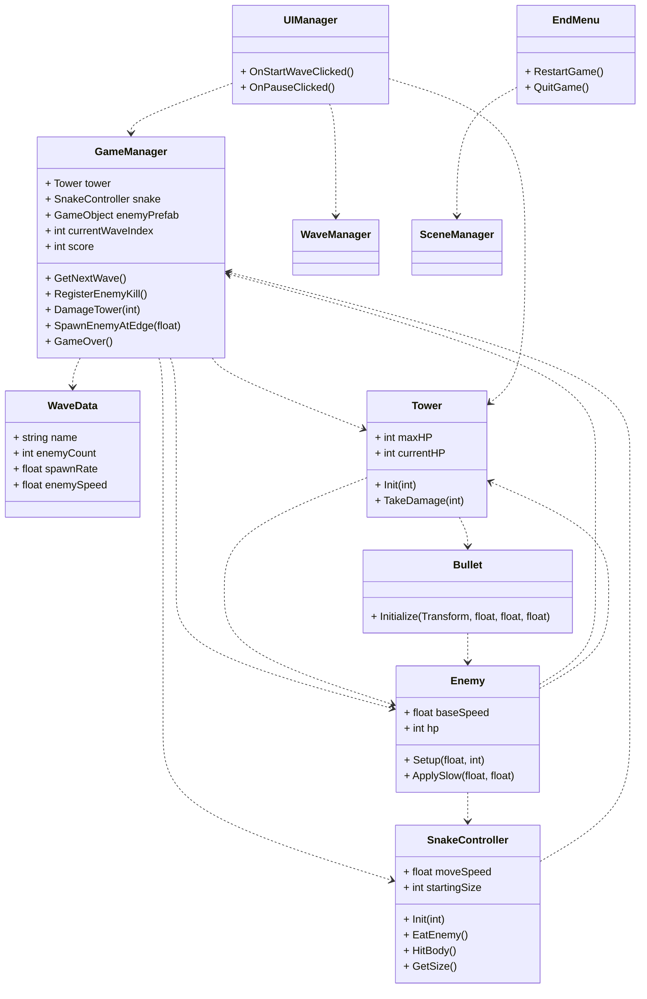

```mermaid
---
Title: Class Diagram Tower Defense
---

classDiagram

class GameManager {
    + Tower tower
    + SnakeController snake
    + GameObject enemyPrefab
    + int currentWaveIndex
    + int score
    + GetNextWave()
    + RegisterEnemyKill()
    + DamageTower(int)
    + SpawnEnemyAtEdge(float)
    + GameOver()
}

class WaveData {
    + string name
    + int enemyCount
    + float spawnRate
    + float enemySpeed
}

class SnakeController {
    + float moveSpeed
    + int startingSize
    + Init(int)
    + EatEnemy()
    + HitBody()
    + GetSize()
}

class Tower {
    + int maxHP
    + int currentHP
    + Init(int)
    + TakeDamage(int)
}

class Enemy {
    + float baseSpeed
    + int hp
    + Setup(float, int)
    + ApplySlow(float, float)
}

class Bullet {
    + Initialize(Transform, float, float, float)
}

class UIManager {
    + OnStartWaveClicked()
    + OnPauseClicked()
}

class EndMenu {
    + RestartGame()
    + QuitGame()
}

GameManager ..> Tower
GameManager ..> SnakeController
GameManager ..> Enemy
GameManager ..> WaveData

SnakeController ..> GameManager
Enemy ..> GameManager
Enemy ..> SnakeController
Enemy ..> Tower

Tower ..> Enemy
Tower ..> Bullet

Bullet ..> Enemy

UIManager ..> GameManager
UIManager ..> Tower
UIManager ..> WaveManager

EndMenu ..> SceneManager
```